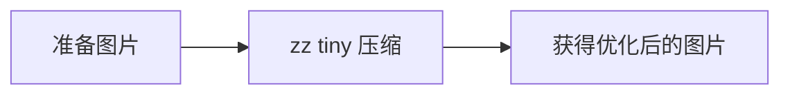

# z-cli 文档目录

## 概述

- [项目介绍](./README.md)
- [功能概览](./overview.md)
- [核心功能详解](./core-features.md)

## 命令参考

### 图片处理工具

- [tiny 命令](./commands/tiny.md) - 基于 Sharp 的图片压缩

### 配置管理

- [set 命令](./commands/set.md) - 快速设置配置项
- [config 命令](./commands/config.md) - 配置的导入、导出、重置

## 使用场景

### 图片处理工作流

**详细步骤**：
1. [使用 tiny 命令压缩图片](./commands/tiny.md#使用示例)
2. [自定义压缩参数](./commands/tiny.md#压缩参数)

## 快速查找

### 按功能查找

| 功能 | 命令 | 文档 |
|------|------|------|
| 压缩图片 | `zz tiny` | [tiny 命令](./commands/tiny.md) |
| 设置配置 | `zz set` | [set 命令](./commands/set.md) |
| 管理配置文件 | `zz config` | [config 命令](./commands/config.md) |

### 按场景查找

| 场景 | 相关命令 | 文档链接 |
|------|---------|---------|
| 批量图片优化 | tiny | [tiny](./commands/tiny.md) |
| 团队协作配置 | config export/import | [config](./commands/config.md#完整工作流) |
| 多环境切换 | config import | [config](./commands/config.md#场景-3多环境切换) |

### 按问题查找

| 问题 | 解决方案 | 文档链接 |
|------|---------|---------|
| 图片压缩后模糊？ | 提高 quality 参数 | [tiny 常见问题](./commands/tiny.md#常见问题) |
| 如何备份配置？ | 使用 config export | [config 使用示例](./commands/config.md#1-导出配置) |
| 如何批量处理图片？ | 使用 tiny -d 目录模式 | [tiny 批量压缩](./commands/tiny.md#3-批量压缩目录) |

## 最佳实践

### 图片处理工作流

1. **压缩参数选择**
   - 网页图片：quality 70-80
   - 打印素材：quality 85-95
   - [详见 tiny 最佳实践](./commands/tiny.md#最佳实践)

2. **批量处理策略**
   - 使用条件过滤避免误操作
   - 先测试单个文件确认效果
   - [详见 tiny 使用示例](./commands/tiny.md#使用示例)

### 配置管理工作流

1. **团队协作**
   - 使用配置模板（移除敏感信息）
   - 每个成员设置自己的配置
   - [详见 config 团队协作](./commands/config.md#场景-2团队协作)

2. **安全建议**
   - 定期备份配置
   - 不要提交敏感信息到 Git
   - [详见 config 安全建议](./commands/config.md#安全建议)

## 附录

### 系统要求

- Node.js >= 18.18.0 (推荐 20.18.1)
- 支持 Windows、macOS、Linux
- 可选：Bun 运行时

### 外部依赖

- **图片处理**：Sharp 库（自动安装）

### 相关链接

- [GitHub 仓库](https://github.com/aatrooox/z-cli)
- [NPM 包](https://www.npmjs.com/package/@zzclub/z-cli)
- [Sharp 文档](https://sharp.pixelplumbing.com/)

### 反馈与贡献

- **问题反馈**：[GitHub Issues](https://github.com/aatrooox/z-cli/issues)
- **功能建议**：欢迎提出新需求
- **代码贡献**：欢迎提交 Pull Request

### 联系方式

- **作者**：aatrox
- **微信**：523748995（定制需求）
